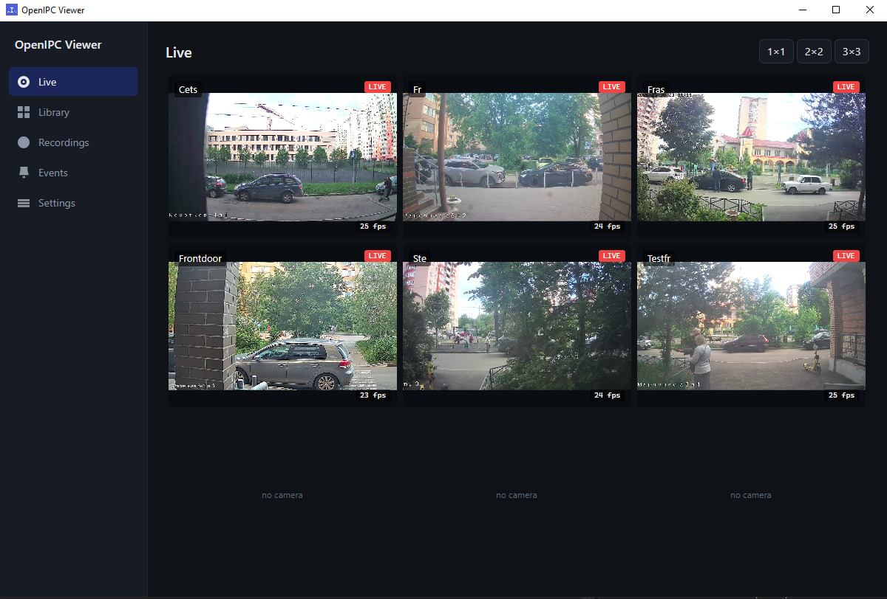
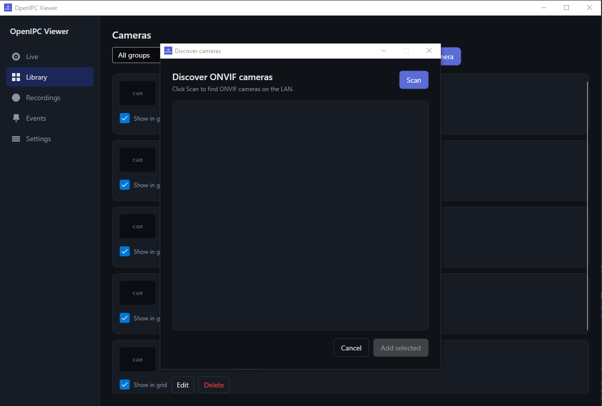
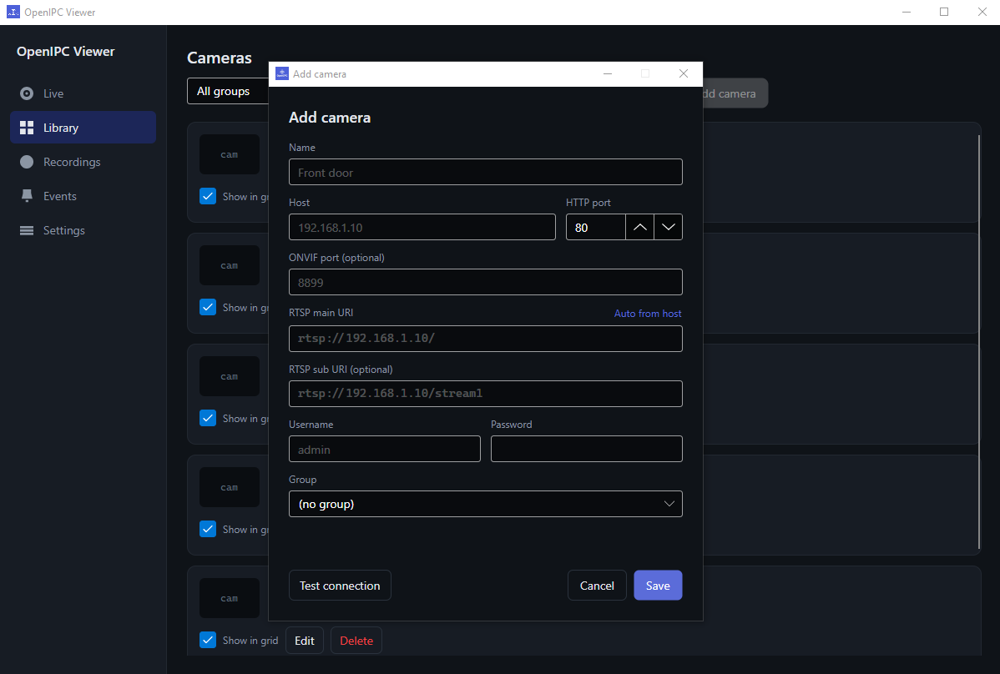
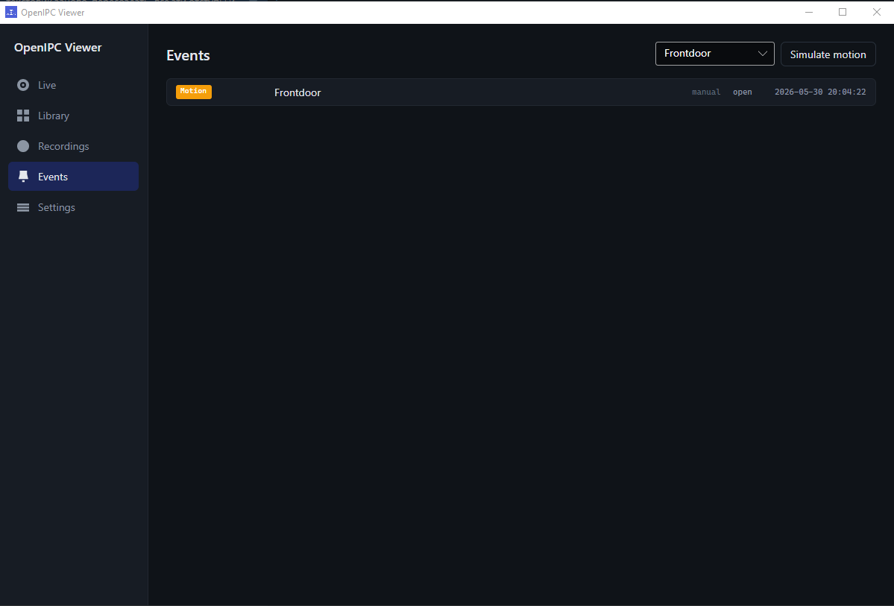
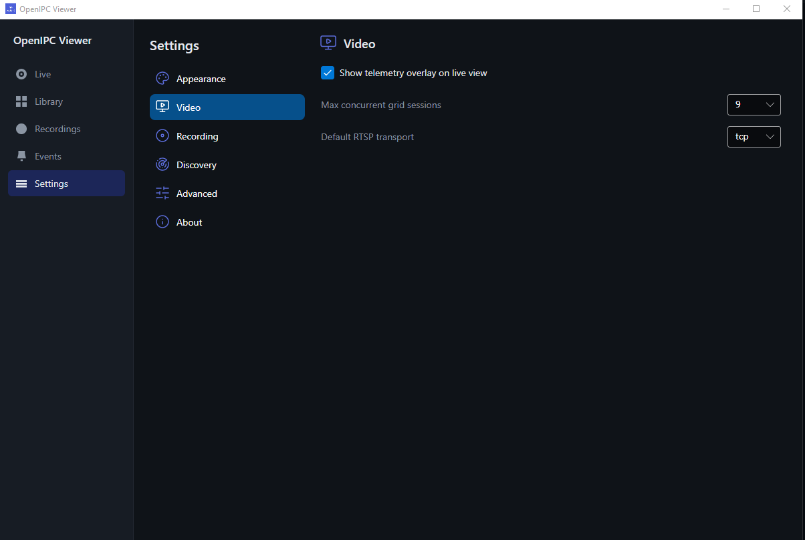
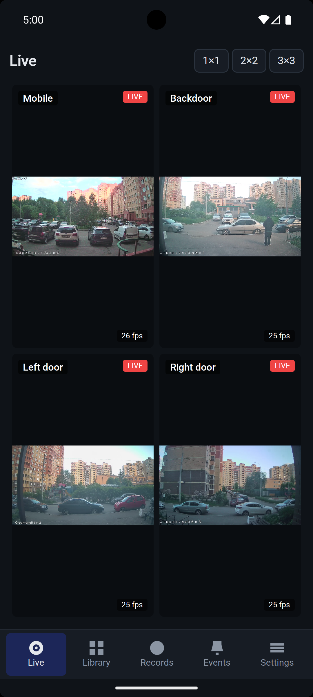
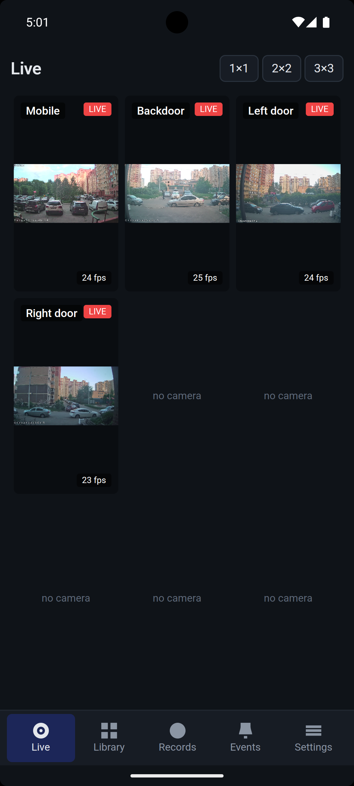

# OpenIPC Viewer

Cross-platform desktop and mobile viewer for OpenIPC IP cameras.
Built with .NET 9 / 10 and Avalonia 12.

[](https://github.com/keyldev/openipc-viewer/actions/workflows/build.yml)

> Status: **release polish** — feature-complete for the first beta. Pending
> packaging (installers / in-app auto-update), code signing, and the
> `v0.1.0-beta` tag. Targets: Windows / Linux / macOS desktops + Android + iOS.
>
> See the [Roadmap](docs/ROADMAP.md) for phase status and what's left before
> the betas.

## Features

- **Live RTSP** — h264 / h265, software + hardware decode (D3D11VA / VAAPI /
  VideoToolbox / Android MediaCodec), auto-reconnect.
- **Multi-camera grid** — up to 25 streams, custom layouts, drag-reorder.
- **Single-camera view** — PTZ joystick + presets, telemetry overlay,
  digital zoom (pinch / Ctrl+wheel), snapshot to disk + share.
- **Recording** — segmented MP4 via `-c copy` (desktop ffmpeg subprocess;
  Android in-process libavformat behind a foreground service).
- **Camera discovery** — ONVIF probe + WS-Discovery, manual add, QR-code add.
- **Majestic integration** — read / apply config with diff preview, raw JSON
  editor, RTMP push, day / night / auto mode.
- **Events** — motion ingestion + persisted log.
- **Camera groups**, English / Russian UI (runtime switch), responsive layout
  (sidebar ↔ bottom tab strip).

## Screenshots

### Desktop (Windows / Linux / macOS)

[](docs/screenshots/desktop-live-grid.jpg)

| Library + ONVIF discovery | Add camera |
|---|---|
| [](docs/screenshots/desktop-library-discover.png) | [](docs/screenshots/desktop-add-camera.png) |

| Events | Settings |
|---|---|
| [](docs/screenshots/desktop-events.png) | [](docs/screenshots/desktop-settings.png) |

### Mobile (Android)

| Live grid 2×2 | Live grid 3×3 |
|---|---|
|  |  |

## Download

Pre-built **standalone** binaries are attached to each
[GitHub release](https://github.com/keyldev/openipc-viewer/releases). No
installer is required for the beta — download, extract, run:

| OS | Asset | Run |
|---|---|---|
| Windows x64 | `openipc-viewer-win-x64.zip` | extract, run `OpenIPC.Viewer.Desktop.exe` (accept the SmartScreen prompt — builds are unsigned for now) |
| Linux x64 | `openipc-viewer-linux-x64.tar.gz` | extract, `chmod +x`, run `./OpenIPC.Viewer.Desktop` |
| macOS arm64 | `openipc-viewer-osx-arm64.tar.gz` | extract, right-click the app → *Open* (Gatekeeper blocks unsigned builds on first launch) |
| Android arm64 | `*-Signed.apk` | sideload (debug-signed, not Play-signed) |

Each build is self-contained (bundles the .NET runtime), so there's nothing
to install alongside it. Native installers and in-app auto-update may come in
a later release.

### Runtime requirements

- **Windows** — none. FFmpeg DLLs ship inside the archive.
- **Linux** — just libsecret for the keyring:
  ```
  sudo apt install libsecret-1-0 libsecret-tools
  ```
  FFmpeg ships **inside the archive** (matching `n7.1` `.so`) — do *not* rely on
  `apt install ffmpeg`. The app binds the FFmpeg 7.x ABI (`libavcodec.so.61`),
  but no current Ubuntu LTS packages FFmpeg 7 (24.04 has 6.1 → `libavcodec.so.60`,
  22.04 has 4.4), so a system FFmpeg would fail to load with *"FFmpeg native
  libraries failed to load for runtime linux-x64"*. The bundled libs sidestep
  the distro version entirely. VAAPI hardware decode still needs
  `/dev/dri/renderD128` and your user in the `render` (or `video`) group.
  Credentials use `secret-tool` against the GNOME/KDE keyring, with an AES-GCM
  file fallback if D-Bus is unavailable.
- **macOS** — Homebrew FFmpeg (`brew install ffmpeg`). VideoToolbox HW decode
  works on any Mac 12+. Credentials live in the Keychain via `security`.

> **Validation caveat.** Linux / macOS / Android / iOS code paths build + link
> in CI but aren't yet end-to-end tested on real devices for every commit.
> Feedback is welcome — open an issue with OS version, what you did, and what
> happened.

## Building from source

```bash
dotnet restore OpenIPC.Viewer.slnx
dotnet build   OpenIPC.Viewer.slnx
dotnet test    OpenIPC.Viewer.slnx --no-build
dotnet run --project src/OpenIPC.Viewer.Desktop
```

Build runs with `TreatWarningsAsErrors=true`; any warning fails the build.
Run the FFmpeg fetch script for your OS once — it downloads the bundled
shared-build (`n7.1` ABI) from `BtbN/FFmpeg-Builds` into `runtimes/<rid>/native/`:
`tools/fetch-ffmpeg.ps1` (Windows → `win-x64`) or `tools/fetch-ffmpeg-linux.sh`
(Linux → `linux-x64`). macOS uses the system Homebrew FFmpeg (see
[Runtime requirements](#runtime-requirements)).

### Android

```bash
dotnet workload install android
dotnet build src/OpenIPC.Viewer.Android/OpenIPC.Viewer.Android.csproj -c Release
```

CI cross-compiles FFmpeg `n7.1` for `android-arm64` via NDK r27c on every
build (cached when version/script unchanged). Recording uses in-process
libavformat + a foreground service (`foregroundServiceType=dataSync`) and
needs `POST_NOTIFICATIONS` on Android 13+, prompted on first record.
Credentials use an AES-GCM file keyed off `Settings.Secure.AndroidId`.

### iOS

```bash
dotnet workload install ios
dotnet build src/OpenIPC.Viewer.iOS/OpenIPC.Viewer.iOS.csproj -c Release    # Mac-only for the link step
```

iOS recording is **foreground-only** — Apple doesn't grant 24/7 background
captures to surveillance apps. Credentials use an AES-GCM file keyed off
`UIDevice.identifierForVendor`. CI builds an unsigned `.app`/`.ipa`;
TestFlight signing arrives in the release-polish phase.

## Project layout

```
src/
  OpenIPC.Viewer.Core/            netstandard2.1 — domain, no IO, no UI, no package deps
  OpenIPC.Viewer.Infrastructure/  net9.0         — SQLite, secrets, decoder factories
  OpenIPC.Viewer.Video/           net9.0         — FFmpeg pipeline (FFmpeg.AutoGen + SkiaSharp)
  OpenIPC.Viewer.Devices/         net9.0         — ONVIF, Majestic HTTP
  OpenIPC.Viewer.App/             net9.0         — Avalonia views and viewmodels (cross-platform)
  OpenIPC.Viewer.Composition/     net9.0         — shared DI registrations (used by every head)
  OpenIPC.Viewer.Desktop/         net9.0         — Win/Lin/Mac host, classic-window lifetime
  OpenIPC.Viewer.Android/         net10.0-android — Android host (min API 31), foreground-service recording
  OpenIPC.Viewer.iOS/             net10.0-ios     — iOS host (min 16), foreground-only recording
tests/
  OpenIPC.Viewer.Core.Tests/      xUnit
  OpenIPC.Viewer.Video.Tests/     xUnit + MediaMTX integration
```

`App` references `Core` only. Infrastructure, Video, Devices and the platform
trio (`IFileSystem` / `ISecretsStore` / `IHwDecoderFactory`) are wired into
each head via `OpenIPC.Viewer.Composition.SharedComposition.AddSharedServices()`.

## Test fixture: MediaMTX

The video integration test and manual smoke depend on a local RTSP source.
A MediaMTX container synthesises a 1280×720@25 h264 test pattern on demand at
`rtsp://localhost:8554/test`.

```bash
docker compose -f tools/mediamtx/docker-compose.yml up -d
# ... do your testing ...
docker compose -f tools/mediamtx/docker-compose.yml down
```

The integration test auto-skips itself if the container isn't reachable.

## User data

Per-platform AppData root:

| OS | Path |
|---|---|
| Windows | `%LOCALAPPDATA%\OpenIPC.Viewer\` |
| Linux | `$XDG_DATA_HOME/openipc-viewer/` (default `~/.local/share/openipc-viewer/`) |
| macOS | `~/Library/Application Support/OpenIPC.Viewer/` |
| Android | `/data/data/org.openipc.viewer/files/` (app-private; uninstall wipes) |
| iOS | `~/Library/Application Support/OpenIPC.Viewer/` (sandbox; Files-app visible via UIFileSharingEnabled) |

Inside the root:

```
logs/openipc-viewer-{date}.log    rolling daily, 7-day retention
appsettings.json                  optional override over the one shipped with the app
usersettings.json                 settings written by the in-app Settings page
openipc-viewer.db                 SQLite (cameras, recordings metadata, events)
secrets.bin / secrets.salt        encrypted credential fallback (used when no native keystore)
snapshots/{camera}/*.jpg          manual snapshots
recordings/                       MP4 segments (Linux/macOS may override via XDG_VIDEOS_DIR / ~/Movies)
```

Credentials live in the native keystore when available (Windows DPAPI /
macOS Keychain / Linux libsecret); the encrypted-file fallback is used
otherwise.

## License

MIT. Bundled FFmpeg DLLs and self-built FFmpeg `.so` are LGPL — shipped as
side-by-side shared libs, replaceable by the user.
